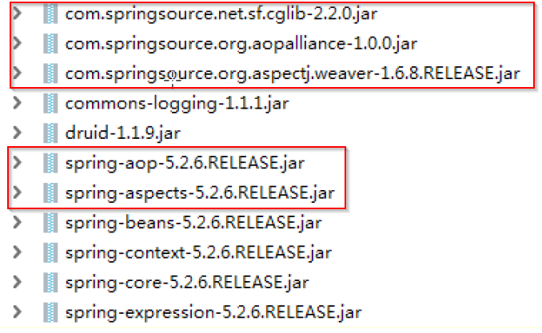

# 概述 & 入门案例

### Spring5概述

1. Spring是轻量级的开源的JavaEE框架
2. Spring可以解决企业应用开发的复杂性
3. Spring有两个核心部分：IOC和Aop
    1. IOC：控制反转，把创建对象过程交给Spring进行管理
    2. Aop：面向切面，不修改源代码进行功能增强

### Spring5入门案例

1. 下载Spring5
    1. 推荐下载GA稳定版本（本课程使用5.2.6GA）
    2. 下载地址：[https://repo.spring.io/release/org/springframework/spring/](https://repo.spring.io/release/org/springframework/spring/)
2. 打开Idea工具，创建一个普通Java工程（jdk1.8）
3. 导入Spring5相关jar包
    1. 从下载的Spring5.2.6的”libs”文件夹中复制以下四个jar包
        
        
        
    2. 下载“commons-logging-1.1.1.jar”
    3. 在Idea的Java工程中创建lib文件夹，粘贴以上5个jar包在该路径下，将5个jar包添加到项目依赖中
    4. 创建User类
        
        ```java
        public class User {
            public void add() {
                System.out.println("add...");
            }
        }
        ```
        
    5. 创建Spring配置文件，在配置文件配置创建的对象
        
        ```xml
        <!--配置User对象创建--> 
        <bean id="user" class="com.tyd.spring5.User"></bean>
        ```
        
    6. 编写测试代码
        
        ```java
        public class TestDemo {
            @Test
            public void testAdd() {
                //1 加载spring配置文件
                ApplicationContext context=new ClassPathXmlApplicationContext("bean1.xml");
                //2 获取配置创建的对象
                User user=context.getBean("user",User.class);
                user.add();
            }
        }
        ```
